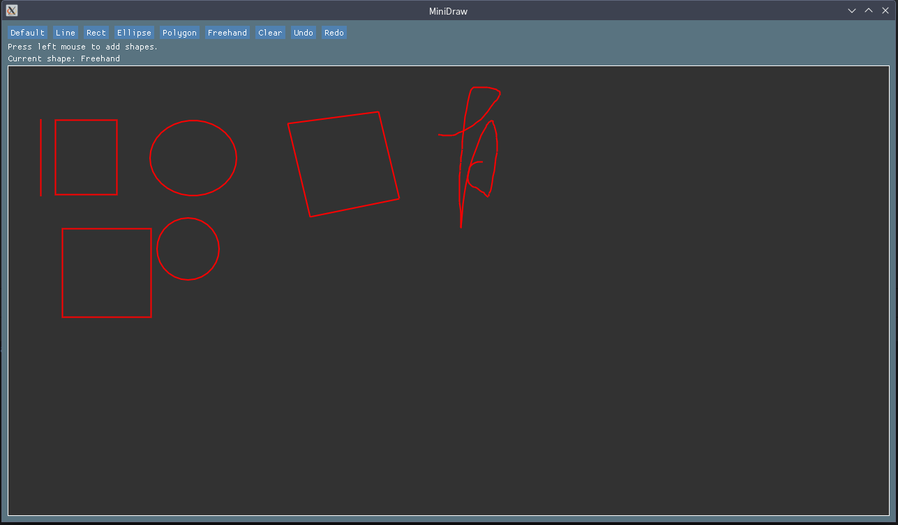
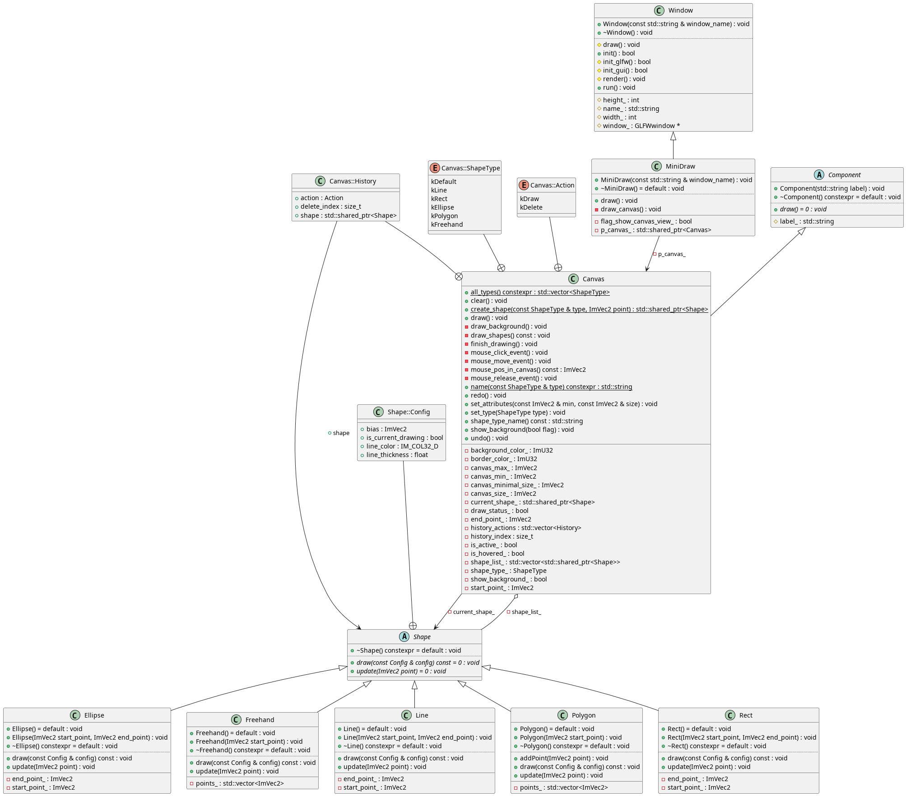

# USTC-CG/2024 课程作业 实验报告

| 实验 1          | 画图小工具 MiniDraw   |
| --------------- | --------------------- |
| 马天开          | PB21000030 (ID: 08)   |
| Due: 2024.03.03 | Submitted: 2024.03.02 |

## 功能实现 Features Implemented

### 作业要求部分 Required Features

分别实现了 `Ellipse` `Freehand` `Polygon` 的绘制，重构了部分 TA 原来提供的逻辑，例如：

- `line.h` 中使用 `ImVec2` 替换两个 `double`
- `Canvas.ShapeType` 从 `enum` 调整为 `class enum`
- 使用 Modern C++ 进行改写，例如

```cpp
// comp_canvas.h
static constexpr std::vector<ShapeType> all_types()
{
    return {
        ShapeType::kDefault, ShapeType::kLine,    ShapeType::kRect,
        ShapeType::kEllipse, ShapeType::kPolygon, ShapeType::kFreehand
    };
}

// window_minidraw.cpp
for (const auto type : Canvas::all_types())
{
    if (ImGui::Button(Canvas::name(type).c_str()))
    {
        p_canvas_->set_type(type);
    }
    ImGui::SameLine();
}
```

上述代码会在编译期间进行展开，不会产生额外的运行时开销，并提高代码的可读性。

### 额外功能 Extra Features

#### 撤回和重做 Undo and Redo

实现了 撤回 Undo 以及 重做 Redo 功能，通过维护一个 `std::vector<History>` 和一个 `index` 来实现。

```cpp
struct History
{
    Action action;
    std::shared_ptr<Shape> shape;
    size_t delete_index = -1;
};

std::vector<History> history_actions;
size_t history_index = -1;
```

相关实现写在 `comp_canvas.cpp` 中

思路概述：

1. 撤回和重做的历史总是线性的
   1. 通过撤回和重做得到的状态总是相同的
2. 当撤回到过去的某个时间点后，时间点后的历史记录会被删除，相关资源也应该被回收
   1. `shape_list_` 使用了 `std::vector<std::shared_ptr<Shape>>`，其中 `std::shared_ptr` 有基于 Reference Counting 的 GC，无需手动释放资源
3. 由于状态相同，Delete 操作的对象只需要维护一个 `size_t` 即可记录位置，无需维护对象的指针

#### 快捷键 Shortcuts

实现了一些快捷键，例如上文的 撤回 (Ctrl - Z) 和重做 (Ctrl - Y)

以及考虑到用户需要，按住 `Shift` 键时，绘制的 `Ellipse` `Rect` 会被限制为 正圆 和 正方形，可参考截图。

## 运行截图 Screenshots



## 类图 Class Diagram



出于习惯，开发中并没有使用 Visual Studio，使用了[PlantUML](https://plantuml.com/)绘制了类图。

使用到的工具链：

- [clang-uml](https://github.com/bkryza/clang-uml)
- PlantUML from [AUR](https://archlinux.org/packages/extra/any/plantuml/)

设置文件以及具体方法已经通过 PR 提交到了课程的仓库中： <https://github.com/USTC-CG/USTC_CG_24/pull/5>

Markdown 导出的文件中图片可能不清晰，也附在了 `figs` 文件夹中。
