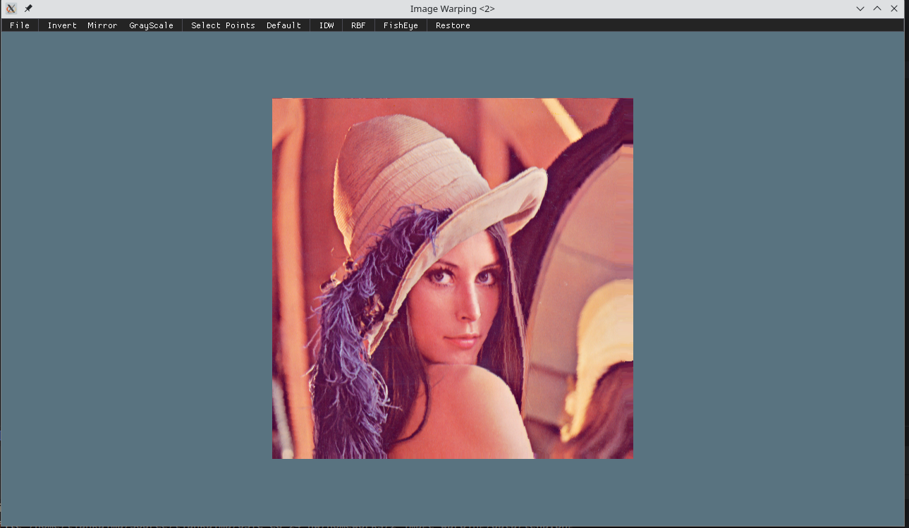
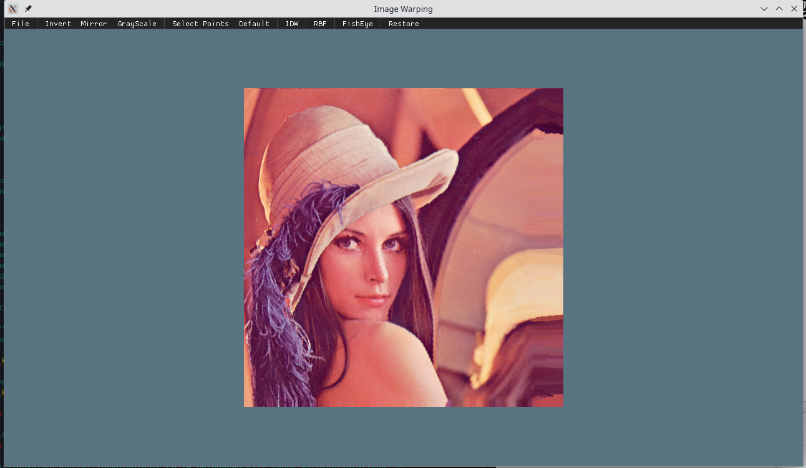
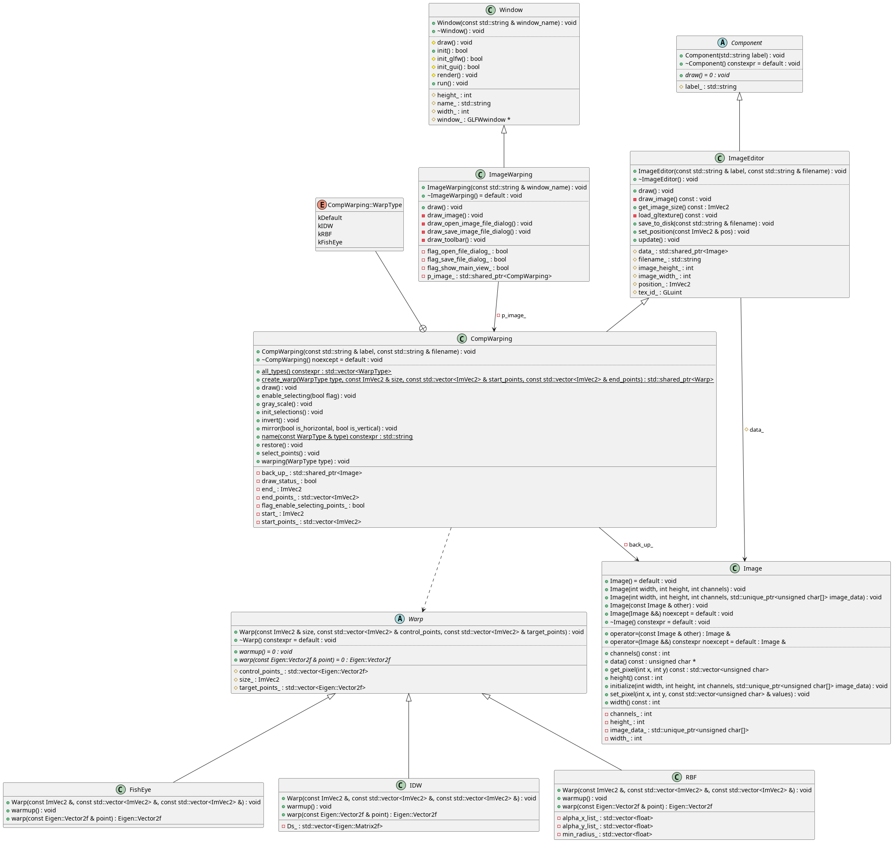

# USTC-CG/2024 课程作业 实验报告

| 实验 2          | 图像变形 Image Warping |
| --------------- | ---------------------- |
| 马天开          | PB21000030 (ID: 08)    |
| Due: 2024.03.10 | Submitted: 2024.03.11  |

## 功能实现 Features Implemented

### 作业要求部分 Required Features

#### 两种 Warping 算法 Two Warping Algorithms

IDW 与 RBF 实现分别存放在 `src/view/warp/idw.cpp` 与 `src/view/warp/rbf.cpp` 中。

两种 Warpping 的方法均通过统一封装的 `Warp` 类进行调用，同时对原来给出的 FishEye 也进行了改写 & 封装。

```cpp
class Warp
{
   public:
    // ...
    virtual void warmup() = 0;
    virtual Eigen::Vector2f warp(const Eigen::Vector2f& point) = 0;

   protected:
    ImVec2 size_;
    std::vector<Eigen::Vector2f> control_points_;
    std::vector<Eigen::Vector2f> target_points_;
};
```

其中 `warmup()` 用于提前计算变形所需的参数，`warp()` 用于进行变形。

!!!note
    对 ImGUI 窗口做了跟上次作业类似的调整，目前三个变形方法对应按钮按下后即变形。

    Eigen 与 ANN 的引用也使用了 submodule, 通过以下方法进行拉取：

    ```bash
    git submodule update --init --recursive
    ```

### 额外功能 Extra Features

#### 白缝填补 Inpainting

实现方法：限于时间原因（看起来已经是晚交了……），使用 ANN 寻找了最邻近点，并没有做插值。

相关代码位于 `src/assignment/2_ImageWarping/comp_warpping.cpp` 中：

```cpp
Annoy::AnnoyIndex<
    int,
    float,
    Annoy::Euclidean,
    Annoy::Kiss64Random,
    Annoy::AnnoyIndexSingleThreadedBuildPolicy>
    ann(2);
int ann_counts = 0;

for (int y = 0; y < data_->height(); ++y)
    for (int x = 0; x < data_->width(); ++x)
    {
        auto p = warp->warp(Eigen::Vector2f((float)x, (float)y));
        auto new_x = static_cast<int>(p(0));
        auto new_y = static_cast<int>(p(1));

        if (new_x >= 0 && new_x < data_->width() && new_y >= 0 &&
            new_y < data_->height())
        {
            std::vector<unsigned char> pixel = data_->get_pixel(x, y);
            warped_image.set_pixel(new_x, new_y, pixel);

            mask[new_x][new_y] = 1;

            auto vec = new float[2];
            vec[0] = (float)new_x;
            vec[1] = (float)new_y;
            ann.add_item(ann_counts++, vec);
        }
    }

ann.build(2);
for (int y = 0; y < data_->height(); ++y)
    for (int x = 0; x < data_->width(); ++x)
        if (!mask[x][y])
        {
            auto vec = new float[2];
            vec[0] = (float)x;
            vec[1] = (float)y;
            std::vector<int> indices;
            ann.get_nns_by_vector(vec, 1, 1, &indices, nullptr);

            auto pos = new float[2];
            ann.get_item(indices[0], pos);
            std::vector<unsigned char> pixel =
                warped_image.get_pixel((int)pos[0], (int)pos[1]);
            warped_image.set_pixel(x, y, pixel);
        }
```

分别通过一个 `mask` 记录已经填充的位置，以及一个 ANN 索引记录最邻近点。

## 运行截图 Screenshots

IDW:



RBF:



## 类图 Class Diagram



Markdown 导出的文件中图片可能不清晰，也附在了 `figs` 文件夹中。
