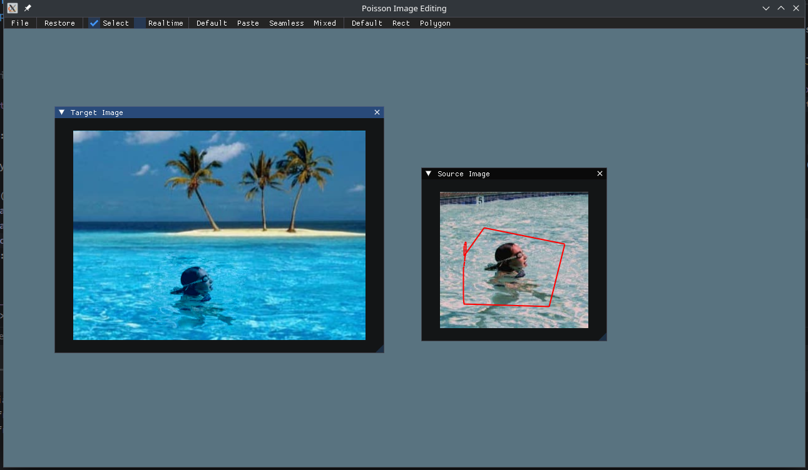
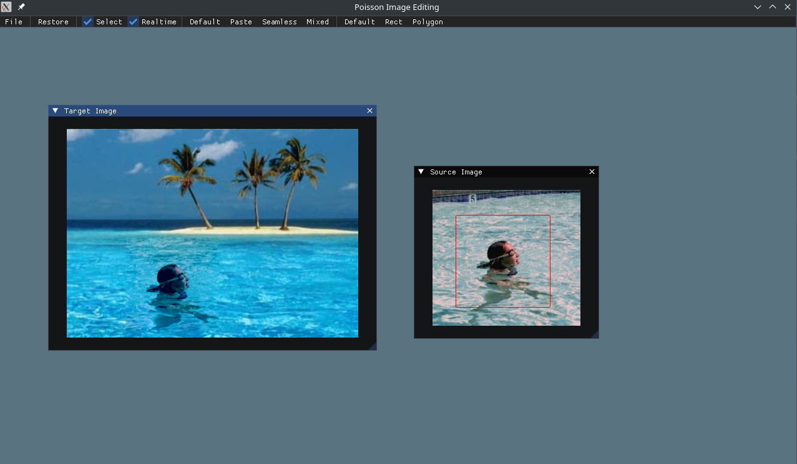
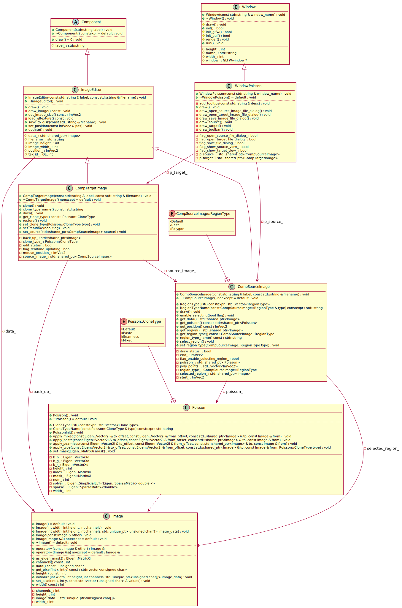

# USTC-CG/2024 课程作业 实验报告

| 实验 3          | 图像融合 Poisson Image Editing |
| --------------- | ---------------------- |
| 马天开          | PB21000030 (ID: 08)    |
| Due: 2024.03.17 | Submitted: 2024.03.18  |

## 功能实现 Features Implemented

### 作业要求部分 Required Features

#### Poisson Image Editing

`Seamless` & `Mixed` 实现都存放在 `src/view/possion.cpp` 中

封装：

```cpp
class Poisson
{
   public:
    void PoissonInit();
    void set_mask(Eigen::MatrixXi mask);
    void apply_paste(const Eigen::Vector2i& to_offset, const Eigen::Vector2i& from_offset, const std::shared_ptr<Image>& to, const Image& from);
    void apply_seamless(const Eigen::Vector2i& to_offset, const Eigen::Vector2i& from_offset, const std::shared_ptr<Image>& to, const Image& from);
    void apply_mixed(const Eigen::Vector2i& to_offset, const Eigen::Vector2i& from_offset, const std::shared_ptr<Image>& to, const Image& from);

   private:
    Eigen::MatrixXi index_;
    int width_, height_, num_;
    Eigen::SparseMatrix<double> sparse_;
    Eigen::SimplicialLLT<Eigen::SparseMatrix<double>> solver_;
    Eigen::MatrixXi mask_;
    Eigen::VectorXd b_r_;
    Eigen::VectorXd b_g_;
    Eigen::VectorXd b_b_;
}
```

其中 `set_mask` 时计算矩阵预分解，`apply()` 用于变形，基于此实现实时拖动的效果。

### 额外功能 Extra Features

#### 复杂边界实现（多边形光栅化的扫描线转换算法）

实现方法：限于时间原因（看起来已经是晚交了……），增加 `RegionType` 并补充扫描线实现。

相关代码位于 `src/assignment/3_ImageWarping/comp_source_image.cpp` 中：

```cpp
for (int i = 0; i < selected_region_->width(); ++i) {
    std::vector<int> intersections;
    for (int j = 0; j < poly_points_.size() - 1; j++)
    {
        ImVec2 p1 = poly_points_[j];
        ImVec2 p2 = poly_points_[j + 1];
        if ((p1.y > i && p2.y < i) || (p1.y < i && p2.y > i))
        {
            float x = p1.x + (i - p1.y) * (p2.x - p1.x) / (p2.y - p1.y);
            intersections.push_back(static_cast<int>(x));
        }
    }
    // last -> 0:
    // ... ommitted

    std::sort(intersections.begin(), intersections.end());
    for (int j = 0; j < intersections.size(); j += 2)
        for (int k = intersections[j]; k < intersections[j + 1]; k++)
            selected_region_->set_pixel(k, i, { 255 });
}
```

对于每个 $x$ 维护一个交点列表，然后进行排序，最后填充。

## 运行截图 Screenshots

IDW:



RBF:



## 类图 Class Diagram



Markdown 导出的文件中图片可能不清晰，也附在了 `figs` 文件夹中。

> 感谢助教指出来可以到处 SVG, 差点忘了这码事 (x)
>
> ~~另外看在调试 GitHub Actions 也耗时间的能不能把晚交的 -0.5 抹掉~~(x)
