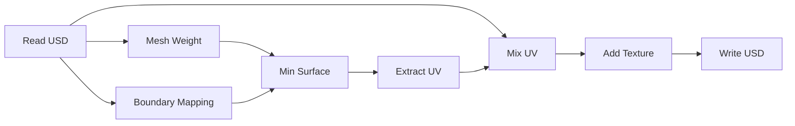
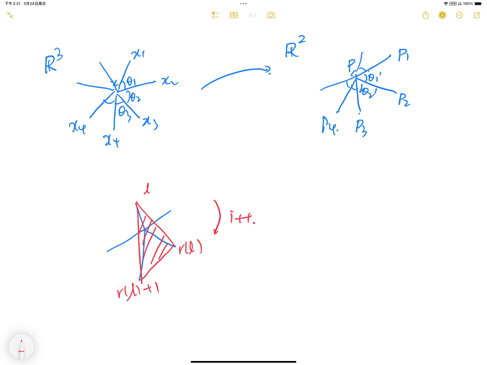
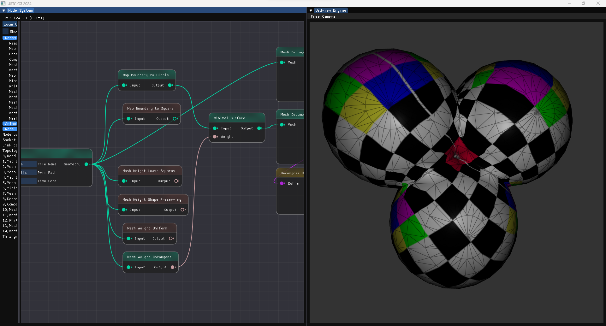
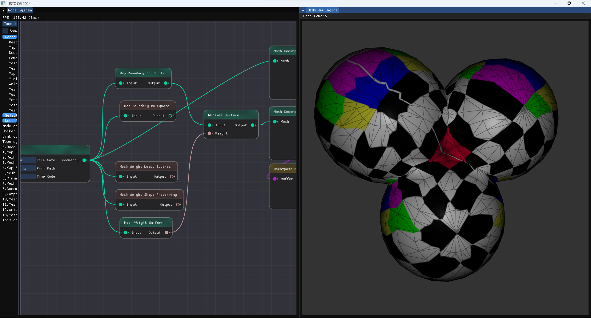
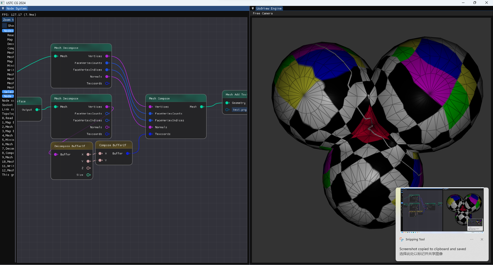
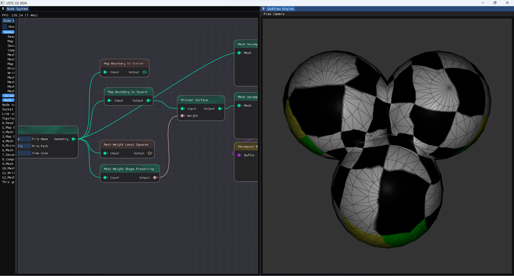

# USTC-CG/2024 课程作业 实验报告

| 实验 3          | 图像融合 Poisson Image Editing |
| --------------- | ---------------------- |
| 马天开          | PB21000030 (ID: 08)    |
| Due: 2024.03.24 | Submitted: 2024.03.24  |

## 功能实现 Features Implemented

### 作业要求部分 Required Features

#### Uniform & Cotangent 权重计算

实现位置：`node_mesh_weight_cotangent.cpp` & `node_mesh_weight_uniform.cpp`

不同 weight 通过一个展平的 $ n \times n $ 矩阵 (`Buffer1f`) 传递给「极小曲面计算」节点。

**Cotangent Weight:**

$$
\begin{aligned}
    \text{cot}(\alpha) &= \frac{\text{edge1} \cdot \text{edge2}}{\left\| \text{edge1} \times \text{edge2} \right\|} \\
    \text{cot}(\beta) &= \frac{\text{edge3} \cdot \text{edge4}}{\left\| \text{edge3} \times \text{edge4} \right\|}
\end{aligned} \Rightarrow \text{weight} = -\text{cot}(\alpha) - \text{cot}(\beta)
$$

```cpp
// node_mesh_weight_cotangent.cpp
pxr::VtArray<float> result(n * n);

for (const auto& vertex : mesh->vertices()) {
    if (vertex.is_boundary()) {
        result[vertex.idx() * n + vertex.idx()] = 1.0f;
        continue;
    }

    auto sum = 0.0f;
    for (const auto& half_edge : vertex.outgoing_halfedges()) {
        auto vertex2 = half_edge.to();
        auto vertex3 = half_edge.prev().opp().to();
        auto vertex4 = half_edge.next().to();

        auto edge1 = mesh->point(vertex2) - mesh->point(vertex3);
        auto edge2 = mesh->point(vertex) - mesh->point(vertex3);
        auto edge3 = mesh->point(vertex2) - mesh->point(vertex4);
        auto edge4 = mesh->point(vertex) - mesh->point(vertex4);

        // cot = cos() / sin() => dot product / cross product
        auto cot1 = edge1.dot(edge2) / (edge1.cross(edge2).norm());
        auto cot2 = edge3.dot(edge4) / (edge3.cross(edge4).norm());

        cot1 = abs(cot1);
        cot2 = abs(cot2);

        sum += cot1 + cot2;
        result[vertex.idx() * n + vertex2.idx()] = -cot1 - cot2;
    }
    result[vertex.idx() * n + vertex.idx()] = sum;
}
```

#### 极小曲面计算

实现位置：`node_min_surf.cpp`

将传递进来的 weight 重新展开成 `Eigen::SparseMatrix`，并通过 `Eigen::SparseLU` 求解线性方程组。

**Laplace 方程的建立和求解：**

- 边界条件： $$ u = g\quad x \in \Omega \Rightarrow v'_i = v_i \quad \text{if } i \in \text{boundary} $$
- 平均曲率为零： $$ \Delta u = 0 \quad x \in \Omega \Rightarrow \sum_{j \in N(i)} w_{ij} (v_i - v_j) = 0 $$

考虑建立一个大型稀疏矩阵，其中每一行、列对应一个顶点，每个元素对应一个权重; 上述条件中的每个方程对应一个行向量 (边界点不参与平均曲率的计算，意味着每个节点对应一个方程)

```cpp
// node_min_surf.cpp
for (int i = 0; i < n; i++)
    for (int j = 0; j < n; j++)
        if (weight[i * n + j] != 0)
            coefficients.emplace_back(i, j, weight[i * n + j]);

for (const auto& vertex : mesh->vertices()) {
    auto i = vertex.idx();
    PolyMesh::Point p = mesh->point(vertex);
    if (vertex.is_boundary()) {
        b_x[i] = p[0];
        b_y[i] = p[1];
        b_z[i] = p[2];
        continue;
    }
    else {
        b_x[i] = 0;
        b_y[i] = 0;
        b_z[i] = 0;
    }
}

// Generate sparse matrix out of coefficients
Eigen::SparseMatrix<double> A(n, n);
A.setZero();
A.setFromTriplets(coefficients.begin(), coefficients.end());
// Solve the linear system
Eigen::SparseLU<Eigen::SparseMatrix<double>> solver;
solver.compute(A);
if (solver.info() != Eigen::Success) {
    throw std::runtime_error("Failed to decompose the matrix.");
}
```

#### Tutte 参数化

实现位置：`node_boundary_mapping.cpp`

思路：首先找到一个边界点; 从这个边界点开始寻找下一个，直至回到自身。(由于 Openmesh 边界只存储了一个 half edge, 上述遍历总能保证单向)

```cpp
// node_boundary_mapping.cpp
auto find_boundary_loop(PolyMesh* mesh)
{
    OpenMesh::SmartVertexHandle start_vertex;
    for (auto vertex : mesh->vertices()) {
        if (vertex.is_boundary()) {
            start_vertex = vertex;
            break;
        }
    }

    std::vector<PolyMesh::VertexHandle> boundary_loop;
    auto current_vertex = start_vertex;
    do {
        boundary_loop.push_back(current_vertex);
        for (auto vertex : current_vertex.vertices()) {
            if (vertex.is_boundary()) {
                current_vertex = vertex;
                break;
            }
        }
    } while (current_vertex != start_vertex);

    return boundary_loop;
}
```

接下来只需要实现一个从 $[0,1]$ 到 $\mathbb{R}^2 \subset \mathbb{R}^3$ 的映射即可。(正方形、圆形)

#### 纹理映射

把上述节点按照如下思路连接起来：



### 额外功能 Extra Features

#### Least Squares & Shape-preserving 权重计算

实现位置：`node_mesh_wls.cpp` & `node_mesh_weight_shape_preserving.cpp`

**Least Squares Weight:**

$$
\displaystyle
w_{ij} = \frac{1}{\left\| \boldsymbol{v}_i - \boldsymbol{v}_j \right\|^2}
$$

可提前做归一化处理，也可以直接令 $w_{ii} = \sum_{j\neq i} w_{_ij}$

**Shape-preserving Weight:**

实现思路较为繁琐，做一点简单的拆解：

对于任意的内点，对它的 $1$-邻域做如下保角度比例的变换到$\mathbb{R}^2$上：



在这样的变换前后，保证

$$
\theta_1' / \theta_1 = \theta_2' / \theta_2 = \cdots = \theta_n' / \theta_n
$$

(对应实现思路：记录 `theta_sum` , 然后将每个角度变换为 `2 * PI * theta / theta_sum`. 变换后每点的坐标为 $\left( r \cdot \cos(\theta'), r \cdot \sin(\theta') \right)$)

变换后各个 weight 计算方法为如下过程的累加：

对于任意的 $l \in N(i)$, 寻找这样一个 $r(l) \in N(i)$, 使得

$ P $ 在 $P_l, P_{r(l)}, P_{r(l) + 1} $ 三点构成的三角形中。

此时 $PP_l$, $PP_{r(l)}$, $PP_{r(l) + 1}$ 三条线段将三角形分割为三部分。
此时给这三个点增加权重，分别为与其不相邻的小三角形占总面积的比例。

```cpp
std::vector<float> angles, lengths, id_list;
auto angles_sum = 0.0f;
for (const auto& half_edge : vertex.outgoing_halfedges()) {
    auto next_edge = half_edge.next();
    auto edge_1 = mesh->point(next_edge.to()) - mesh->point(vertex);
    auto edge_2 = mesh->point(half_edge.to()) - mesh->point(vertex);

    auto cos_angle = edge_1.dot(edge_2) / (edge_1.norm() * edge_2.norm());
    auto angle = acos(cos_angle);
    angles.push_back(angle);
    angles_sum += angle;

    lengths.push_back(edge_2.norm());
    id_list.push_back(half_edge.to().idx());
}

std::vector<Eigen::Vector2f> neighbors;
auto theta = 0.0f;
for (auto i = 0; i < angles.size(); i++) {
    neighbors.push_back(Eigen::Vector2f(lengths[i] * cos(theta), lengths[i] * sin(theta)));
    theta += 2 * M_PI * angles[i] / angles_sum;
}

Eigen::Vector2f p(0.0f, 0.0f);

for (auto i = 0; i < angles.size(); i++) {
    auto p1 = neighbors[i];
    for (auto j = 0; j < angles.size(); j++) {
        auto next = (j + 1) % angles.size();
        if (j != i && next != i) {
            auto p2 = neighbors[j];
            auto p3 = neighbors[next];

            auto S = tri_area(p1, p2, p3);
            auto sigma1 = tri_area(p, p2, p3) / S;
            auto sigma2 = tri_area(p1, p, p3) / S;
            auto sigma3 = tri_area(p1, p2, p) / S;

            if (sigma1 + sigma2 + sigma3 < 1.001) {
                result[vertex.idx() * n + vertex.idx()] += 1.0f;
                result[vertex.idx() * n + id_list[i]] += -sigma1;
                result[vertex.idx() * n + id_list[j]] += -sigma2;
                result[vertex.idx() * n + id_list[next]] += -sigma3;
            }
        }
    }
}
```


## 运行截图 Screenshots

**圆形边界 & Cotangent 权重：**



**圆形边界 & Uniform 权重：**



**圆形边界 & Shape-preserving 权重：**



**正方形边界 & Shape-preserving 权重：**


