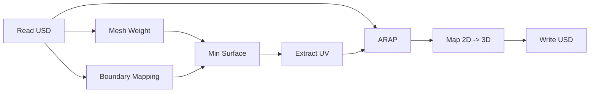
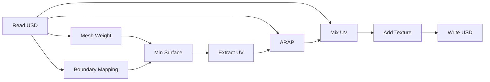

# USTC-CG/2024 课程作业 实验报告

| 实验 4          | ARAP 参数化 |
| --------------- | ---------------------- |
| 马天开          | PB21000030 (ID: 08)    |
| Due: 2024.04.02 | Submitted: 2024.04.02  |

## 功能实现 Features Implemented

### 作业要求部分 Required Features

#### ARAP 参数化 ARAP Parametrization

##### 建模 Modeling

下文中使用的记号说明如下:

$ x_t = \{x_t^0, x_t^1, x_t^2\}$ 表示在 Mesh 中第 $t$ 面的三个顶点(映射到一个局部的 2D 坐标)
$ u_t = \{u_t^0, u_t^1, u_t^2\}$ 表示在对应面映射到纹理坐标的三个点

$J_t(u)$ 表示从 $x_t$ 到 $u_t$ 的 Jacobian 矩阵, $L_t$ 表示 $J_t(u)$ 的正交逼近.

问题转化为最小化如下能量:

$$
E(u,L) = \sum_{t=1}^{T} A_t\left\| J_t(u) - L_t \right\|_F^2
$$

其中 $\left\| \cdot \right\|_F$ 表示 Frobenius 范数. 进一步考虑, 上述问题可以表述为:

$$
E(u,L) = \frac 12 \sum_{t=1}^{T} \sum_{i=0}^2 cot (\theta_t^i) \left\| u_t^i - u_t^{i+1} - L_t(x_t^i - x_t^{i+1}) \right\|_2^2
$$

ARAP 可以拆解为两个阶段:

1. 局部阶段: 对每个三角形 $t$ 独立执行, 计算 $L_t$.

可以通过如下等价矩阵进行 SVD 分解得到:

$$
S_t(u) = \sum_{i=0}^2 cot (\theta_t^i) (u_t^i - u_t^{i+1}) (x_t^i - x_t^{i+1})^T
$$

2. 全局阶段: 固定 $L_t$, 更新 $u_t$.

$$
\begin{aligned}
E(u,L) &= \frac 12 \sum_{t=1}^{T} \sum_{i=0}^2 cot (\theta_t^i) \left\| u_t^i - u_t^{i+1} - L_t(x_t^i - x_t^{i+1}) \right\|_2^2 \\
& = \frac 12 \sum_{(i,j)\in he}^{T} cot (\theta_{ij}) \left\| u_i - u_j - L_{t(i,j)}(x_i - x_j) \right\|_2^2
\end{aligned}
$$

对上述问题取梯度:

$$
\sum_{j \in N(i)} [cot(\theta_{ij}) + cot(\theta_{ji})] (u_i - u_j) = \sum_{j \in N(i)} [cot(\theta_{ij})L_{t(i,j)} + cot(\theta_{ji})L_{t(i,j)}] (x_i - x_j)
$$

建立大型稀疏矩阵进行求解即可.

##### 一些具体问题的处理

- 标号、定向问题:
    以 OpenMesh 提供的 `face.vertices()` 的顺序作为定向, 依次标记为 $i=0,1,2$.
    角度的标号等价于顶点. 边的编号等于唯一一个不在这两个顶点中的顶点编号.(如 $i,j$ 为两个顶点, 则 $k$ 为第三个顶点)

    以上问题均在 $MOD\ 3$ 意义下, 因此 $(i-1) = (i+2) \mod 3$.

- 局部 2D 坐标:
    只需要考虑原 3D 坐标中 三条边的长度、一个角度值即可

#### `Blueprints.json`

**检查结果**

**显示纹理图**

### 额外功能 Extra Features

## 运行截图 Screenshots
