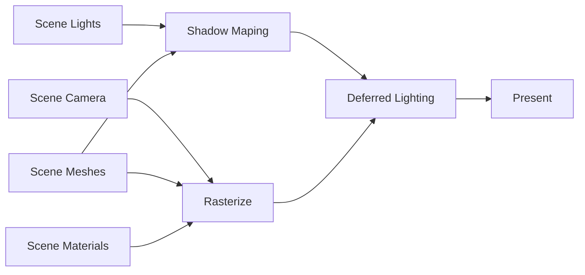
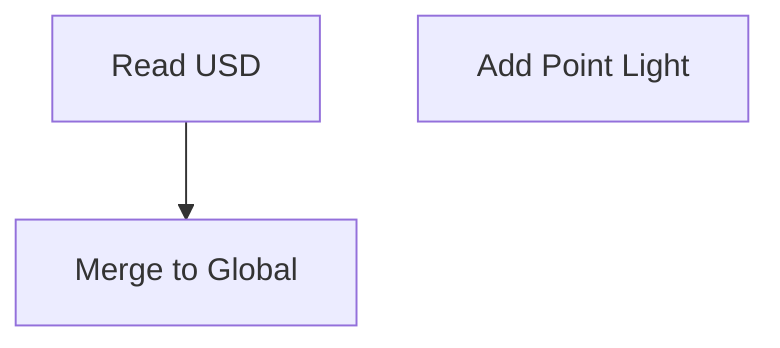

# USTC-CG/2024 课程作业 实验报告

| 实验 6          | Shaders               |
| --------------- | --------------------- |
| 马天开          | PB21000030 (ID: 08)   |
| Due: 2024.04.14 | Submitted: 2024.04.14 |

## 功能实现 Features Implemented

### 作业要求部分 Required Features

#### 实现 Blinn-Phong 着色模型

TBN 矩阵的计算：

```glsl
vec3 normalmap_value = texture2D(normalMapSampler, vTexcoord).xyz;
normal = normalize(vertexNormal);

vec3 edge1 = dFdx(vertexPosition);
vec3 edge2 = dFdy(vertexPosition);
vec2 deltaUV1 = dFdx(vTexcoord);
vec2 deltaUV2 = dFdy(vTexcoord);

tangent = edge1 * deltaUV2.y - edge2 * deltaUV1.y;

if(length(tangent) < 1E-7) {
    vec3 bitangent = -edge1 * deltaUV2.x + edge2 * deltaUV1.x;
    tangent = normalize(cross(bitangent, normal));
}

tangent = normalize(tangent - dot(tangent, normal) * normal);
bitangent = normalize(cross(tangent,normal));
```

Blinn-Phong 着色模型的计算：

```glsl
vec3 lightDir = normalize(lights[i].position - pos);
vec3 viewDir = normalize(camPos - pos);
vec3 halfwayDir = normalize(lightDir + viewDir);
vec3 light_color = lights[i].color;
vec3 ambient_color = 0 * light_color;
vec3 diffuse_color = texture2D(diffuseColorSampler, uv).xyz;

float diffuse = abs(dot(normal, lightDir));
float specular = abs(dot(normal, halfwayDir));

if (diffuse == 0.0) {
    specular = 0.0;
} else {
    specular = pow(specular, shininess);
}

Color = vec4(ambient_color + diffuse * light_color * diffuse_color + specular * light_color, 1.0);

int shadow_map_id = lights[i].shadow_map_id;
float shadow_map_value = texture(shadow_maps, vec3(uv, shadow_map_id)).x;
```

#### 实现 Shadow Mapping 算法

参考 [Learn OpenGL CN](https://learnopengl-cn.github.io/05%20Advanced%20Lighting/03%20Shadows/01%20Shadow%20Mapping/)

#### Render Graph



#### Composition Graph



### 额外功能 Extra Features

## 运行截图 Screenshots


