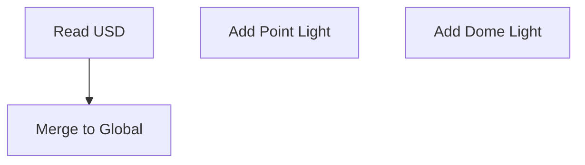
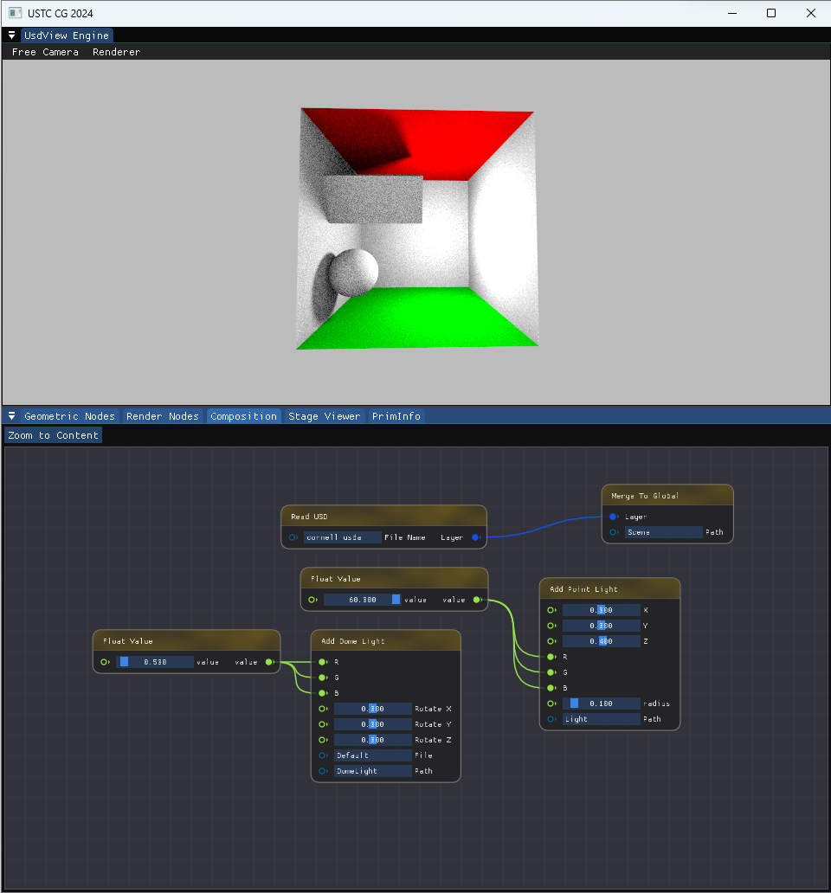

# USTC-CG/2024 课程作业 实验报告

| 实验 7          | Path Tracing          |
| --------------- | --------------------- |
| 马天开          | PB21000030 (ID: 08)   |
| Due: 2024.04.21 | Submitted: 2024.04.23 |

## 功能实现 Features Implemented

### 作业要求部分 Required Features

#### 实现 Rectangle 光源

```cpp
Color Hd_USTC_CG_Rect_Light::Sample(
    const GfVec3f& pos,
    GfVec3f& dir,
    GfVec3f& sampled_light_pos,
    float& sample_light_pdf,
    const std::function<float()>& uniform_float)
{
    auto sampledPos = GfVec3f(
        corner0[0] + (corner1[0] - corner0[0]) * uniform_float(),
        corner0[1] + (corner2[1] - corner0[1]) * uniform_float(),
        corner0[2]);

    sampled_light_pos = sampledPos;

    dir = (sampledPos - pos).GetNormalized();
    auto distance = (sampledPos - pos).GetLength();

    sample_light_pdf = 1.0f / area;

    return irradiance;
}

Color Hd_USTC_CG_Rect_Light::Intersect(const GfRay& ray, float& depth)
{
    double distance;
    if (ray.Intersect(corner0, corner1, corner2, &distance) ||
        ray.Intersect(corner1, corner2, corner3, &distance)) {
        depth = distance;
        return irradiance;
    }
    depth = std::numeric_limits<float>::infinity();
    return { 0, 0, 0 };
}
```

#### Path Tracing Integrator

```cpp
// Russian roulette：
float p = 0.8f;
float q = 1 - p;
float r = uniform_float();
if (r < p) {
    return directLight / p;
}
else {
    const unsigned spp = (2 << 9);

    for (int i = 0; i < spp; i++) {
        float pdf;
        GfVec3f shadowDir = si.TangentToWorld(
            CosineWeightedDirection(GfVec2f{ uniform_float(), uniform_float() }, pdf));
        GfRay shadow_ray;
        shadow_ray.SetPointAndDirection(si.position + 0.00001f * si.geometricNormal, shadowDir);

        if (VisibilityTest(shadow_ray)) {
            GfVec3f newColor =
                EstimateOutGoingRadiance(shadow_ray, uniform_float, recursion_depth + 1);
            color += GfDot(shadowDir, si.shadingNormal) / pdf * newColor;
        }
    }

    color /= spp;
    return color / q + directLight;
}
```

#### Composition Graph



<!-- ### 额外功能 Extra Features -->

## 运行截图 Screenshots


